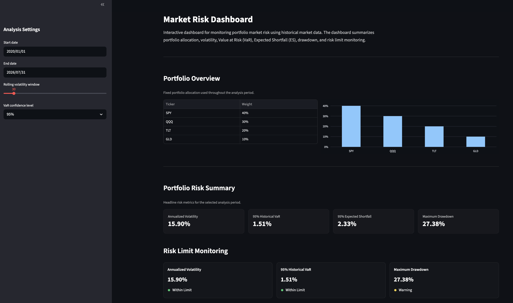
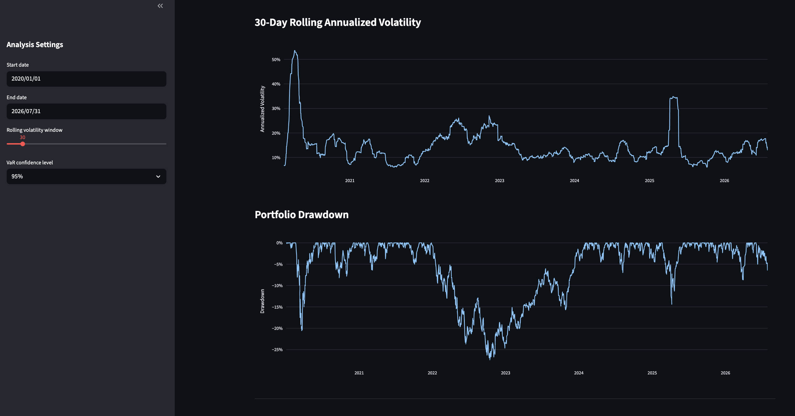
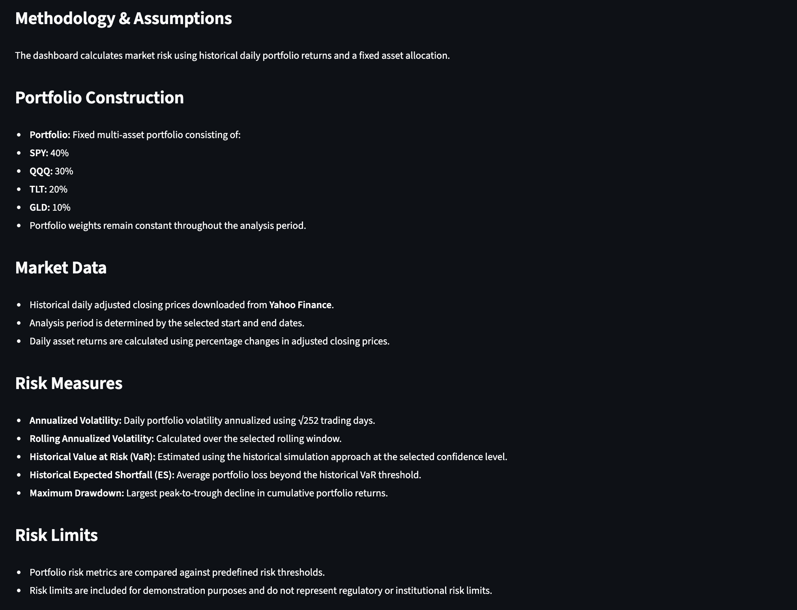

# Market Risk Dashboard

A Python-based dashboard for monitoring the market risk of a fixed multi-asset portfolio using historical market data and industry-standard risk metrics.

---

## Project Overview

This project implements a market risk dashboard that analyzes the historical performance and risk profile of a fixed multi-asset portfolio. It combines quantitative risk analytics with an interactive Streamlit interface to provide a clear and intuitive view of portfolio risk.

The dashboard retrieves historical market data, constructs a fixed portfolio of exchange-traded funds (ETFs), calculates daily portfolio returns, and evaluates key market risk metrics, including annualized volatility, Historical Value at Risk (VaR), Historical Expected Shortfall (ES), rolling volatility, and maximum drawdown. It also monitors portfolio risk against predefined risk limits and presents the results through interactive visualizations.

This project demonstrates the application of Python for financial data analysis, market risk measurement, data visualization, and dashboard development using industry-standard risk metrics and best practices.

---

## Dashboard Preview

The dashboard provides an interactive interface for monitoring the market risk of a fixed multi-asset portfolio. It combines portfolio composition, key risk metrics, risk limit monitoring, historical risk trends, and calculation methodology into a single application.

### Portfolio Overview & Risk Summary

The main dashboard displays the portfolio allocation, headline risk metrics, and current risk status, providing an at-a-glance summary of the portfolio's market risk profile.



---

### Risk Analytics

Rolling annualized volatility and portfolio drawdown are visualized using interactive time-series charts to help monitor the evolution of portfolio risk over time.



---

### Methodology & Assumptions

The dashboard documents the portfolio construction, market data source, risk measurement methodology, and project assumptions to provide transparency into the underlying calculations.



---

## Key Features

- Retrieve historical market data from Yahoo Finance using `yfinance`
- Construct a fixed multi-asset ETF portfolio
- Calculate daily portfolio returns using fixed portfolio weights
- Calculate daily and annualized portfolio volatility
- Calculate rolling annualized volatility over a configurable window
- Estimate Historical Value at Risk (VaR)
- Estimate Historical Expected Shortfall (ES)
- Calculate maximum drawdown
- Monitor portfolio risk against predefined risk limits
- Visualize portfolio risk through an interactive Streamlit dashboard
- Configure the analysis period, rolling window, and confidence level through the dashboard interface

---

## Methodology

### Portfolio Construction

The portfolio consists of four exchange-traded funds (ETFs) with fixed portfolio weights throughout the analysis period.

| Asset | Weight |
|------|-------:|
| SPY | 40% |
| QQQ | 30% |
| TLT | 20% |
| GLD | 10% |

### Market Data

- Historical daily adjusted closing prices are downloaded from Yahoo Finance.
- Daily asset returns are calculated using percentage changes in adjusted closing prices.
- Portfolio returns are calculated as the weighted sum of individual asset returns using fixed portfolio weights.

### Risk Measures

The dashboard implements several industry-standard market risk measures:

- **Annualized Volatility** — Measures the overall variability of portfolio returns.
- **Rolling Annualized Volatility** — Monitors how portfolio volatility evolves over time.
- **Historical Value at Risk (VaR)** — Estimates the maximum expected one-day loss at a specified confidence level using historical simulation.
- **Historical Expected Shortfall (ES)** — Measures the average loss beyond the VaR threshold.
- **Maximum Drawdown** — Measures the largest peak-to-trough decline in cumulative portfolio value.

### Risk Limit Monitoring

The dashboard compares selected portfolio risk metrics against predefined risk thresholds and classifies each metric as:

- Within Limit
- Warning
- Breach

The thresholds are included for demonstration purposes and do not represent regulatory or institutional risk limits.

---

## Project Structure

```text
market-risk-dashboard/
│
├── images/                    # Dashboard screenshots for the README
│   ├── dashboard1.png
│   ├── dashboard2.png
│   └── dashboard3.png
│
├── src/
│   ├── data/
│   │   └── market_data.py     # Download market data and calculate daily returns
│   │
│   ├── portfolio/
│   │   └── portfolio.py       # Portfolio weights and portfolio return calculation
│   │
│   ├── risk/
│   │   ├── volatility.py      # Volatility calculations
│   │   ├── var.py             # Historical Value at Risk (VaR)
│   │   ├── expected_shortfall.py
│   │   └── drawdown.py        # Maximum drawdown
│   │
│   ├── monitoring/
│   │   └── limits.py          # Risk limit monitoring
│   │
│   └── report/
│       └── report.py          # Portfolio risk reporting
│
├── app.py                     # Streamlit dashboard
├── requirements.txt           # Project dependencies
├── README.md                  # Project documentation
└── .gitignore
```

---

## Technologies Used

### Programming Language

- Python 3

### Libraries

- **Pandas** — Data manipulation and portfolio calculations
- **NumPy** — Numerical computations
- **yfinance** — Historical market data retrieval
- **Plotly** — Interactive data visualization
- **Streamlit** — Interactive dashboard development

### Development Tools

- Git
- GitHub
- Visual Studio Code

---

## Installation

### 1. Clone the repository

```bash
git clone https://github.com/<your-username>/market-risk-dashboard.git
```

### 2. Navigate to the project directory

```bash
cd market-risk-dashboard
```

### 3. Create a virtual environment

```bash
python -m venv .venv
```

### 4. Activate the virtual environment

**macOS / Linux**

```bash
source .venv/bin/activate
```

**Windows**

```bash
.venv\Scripts\activate
```

### 5. Install the required packages

```bash
pip install -r requirements.txt
```

The project is now ready to run.

---

## Usage

Start the Streamlit application:

```bash
streamlit run app.py
```

The dashboard will open automatically in your default web browser.

Using the dashboard, you can:

- Select the analysis period using the sidebar controls.
- Adjust the rolling volatility window.
- Choose the confidence level for Historical Value at Risk (VaR) and Expected Shortfall (ES).
- Monitor key portfolio risk metrics and risk limit status.
- Explore historical portfolio risk through interactive visualizations.

---

## Future Enhancements

Potential future enhancements include:

- Deploy the dashboard using Streamlit Community Cloud.
- Support user-defined portfolio allocations.
- Add stress testing and scenario analysis.
- Implement Monte Carlo and parametric Value at Risk (VaR).
- Add portfolio performance and return attribution metrics.
- Export risk reports to PDF or Excel.
- Connect to additional market data providers.

---

## License

This project is licensed under the MIT License.

You are welcome to use, modify, and distribute this project in accordance with the terms of the license.
